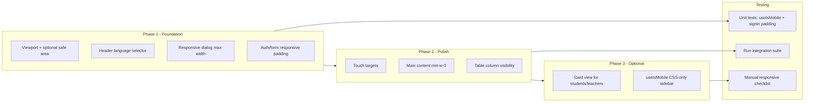

# Mobile-first web app plan

This plan addresses the gaps identified in the analysis so the app is explicitly mobile-first, responsive, and has a polished mobile UI. Work is ordered by impact and dependency.

---

## 1. Viewport and metadata

**Goal:** Explicit viewport and safe-area support so layout and scaling are correct on all devices.

- In **[app/layout.tsx](app/layout.tsx)** (or **[app/[locale]/layout.tsx](app/[locale]/layout.tsx)** if you prefer locale-level control):
  - Export `viewport`: `{ width: 'device-width', initialScale: 1, maximumScale: 5 }` so zoom is allowed for accessibility but initial scale is 1.
  - If you want safe-area insets for notched devices, add `viewportFit: 'cover'` (then use `env(safe-area-inset-*)` in CSS where needed).
- In **[app/globals.css](app/globals.css)** (optional, for notched devices):
  - Add utility or layout rules that use `env(safe-area-inset-top)`, `env(safe-area-inset-bottom)`, etc., for any fixed/sticky headers or full-width bars. Apply to the app header in **[components/app-layout.tsx](components/app-layout.tsx)** (e.g. `padding-left: env(safe-area-inset-left)` on the header) if you enable `viewportFit: 'cover'`.

---

## 2. App header (language selector) on small screens

**Goal:** Avoid crowding the header on very narrow viewports.

- In **[components/app-layout.tsx](components/app-layout.tsx)** (header around line 320):
  - Make the language selector responsive:
    - Option A: Use a responsive width, e.g. `w-full min-w-0 max-w-[160px] sm:max-w-none sm:w-[160px]` so it can shrink when space is tight, and ensure the header uses `flex-wrap` or `min-w-0` so it doesn’t overflow.
    - Option B: On mobile only, show an icon-only trigger that opens the Select in a Sheet or dropdown (requires `useIsMobile()` and conditional render). Option B is more work but gives a cleaner header on very small screens.

Recommendation: implement Option A first; add Option B only if testing shows the header still feels cramped.

---

## 3. Responsive dialog max-width

**Goal:** All dialogs stay within the viewport on mobile; existing `max-w-2xl` overrides currently ignore the default mobile-friendly width.

- **Default in [components/ui/dialog.tsx](components/ui/dialog.tsx):** The base `DialogContent` already has `max-w-[calc(100%-2rem)] sm:max-w-md`. No change needed there.
- **Pages that override with `max-w-2xl`:** Add a mobile-first override so the dialog is full-bleed-with-margin on small screens and `max-w-2xl` from `sm:` up. Replace:
  - `className="max-w-2xl"`  
    with
  - `className="max-w-[calc(100%-2rem)] sm:max-w-2xl"`

Files to update (exact `DialogContent` instances that pass `className="max-w-2xl"`):

- [app/[locale]/organizations/[id]/teachers/page.tsx](app/[locale]/organizations/[id]/teachers/page.tsx) (2)
- [app/[locale]/organizations/[id]/private-sessions/page.tsx](app/[locale]/organizations/[id]/private-sessions/page.tsx) (2)
- [app/[locale]/organizations/[id]/private-sessions/[sessionId]/page.tsx](app/[locale]/organizations/[id]/private-sessions/[sessionId]/page.tsx) (1)
- [app/[locale]/organizations/[id]/groups/[groupId]/page.tsx](app/[locale]/organizations/[id]/groups/[groupId]/page.tsx) (1; the one with `max-w-md` can stay or use `max-w-[calc(100%-2rem)] sm:max-w-md` for consistency)
- [app/[locale]/organizations/[id]/sessions/page.tsx](app/[locale]/organizations/[id]/sessions/page.tsx) (2)

Use the same pattern for any other `DialogContent` that sets a large fixed `max-w-*` so they all respect the mobile width.

---

## 4. Auth and form pages – responsive padding

**Goal:** Comfortable padding on small screens; avoid `p-8` everywhere on mobile.

- **[app/[locale]/signin/page.tsx](app/[locale]/signin/page.tsx):** Change the form container from `p-8` to responsive padding, e.g. `p-4 sm:p-6 lg:p-8` (line ~111).
- **[app/[locale]/signup/page.tsx](app/[locale]/signup/page.tsx):** Same change (line ~54).
- **[app/[locale]/organizations/create/page.tsx](app/[locale]/organizations/create/page.tsx):** Same change (line ~78).

Optional: **[app/[locale]/dashboard/page.tsx](app/[locale]/dashboard/page.tsx)** and **[app/[locale]/organizations/[id]/attendance/page.tsx](app/[locale]/organizations/[id]/attendance/page.tsx)** use `p-8` in cards or centering divs; apply the same responsive padding pattern if those blocks feel tight on mobile.

---

## 5. Touch targets (primary actions)

**Goal:** Primary actions meet a ~44px minimum touch target on mobile for better tap accuracy.

- **[components/ui/button.tsx](components/ui/button.tsx):**
  - Ensure at least one size variant used for primary actions has a minimum height of 44px on touch devices. Options:
    - Add a `default` or `lg` variant that uses `min-h-[44px]` (and keep existing `h-*` for consistency), or
    - Use a media query or touch-capability approach (e.g. `@media (pointer: coarse) { ... min-height: 44px }`) in globals or in the button component so primary buttons are larger on touch devices.
- Use the larger variant (or ensure the chosen variant is used) for main CTAs on key pages (e.g. "Add student", "Save", "Sign in"). No need to change every icon button in tables; focus on primary actions in headers and forms.

---

## 6. Main content overflow

**Goal:** Prevent accidental horizontal overflow from flex children or wide content.

- In **[components/app-layout.tsx](components/app-layout.tsx)**, on the main content wrapper (the `main` inside `SidebarInset`, line ~341):
  - Add `min-w-0` so the flex child can shrink and allow the inner table’s `overflow-x-auto` to take effect. Optionally add `overflow-x-hidden` only if you confirm it doesn’t clip intended scroll areas (table container already has `overflow-x-auto`).

---

## 7. Tables on mobile – two approaches

**Current state:** [components/ui/table.tsx](components/ui/table.tsx) wraps the table in `overflow-x-auto`, so wide tables scroll horizontally. Functional but not ideal for a “pristine” mobile list experience.

**Option A – Quick win (recommended first):** Reduce columns on small viewports so the table fits better before scrolling.

- For list pages that use `Table` (students, teachers, venues, groups, sessions, attendance, private-sessions, etc.), add responsive column visibility:
  - On the relevant `TableHead` and `TableCell` pairs, add `className="hidden sm:table-cell"` (or `md:table-cell`) for secondary columns (e.g. "Created at", "Phone", "User account"). Keep the most important columns (e.g. name, primary action) always visible.
- Requires choosing per page which columns are “primary” vs “secondary” and applying the same class to both header and body cells.

**Option B – Card/list view on mobile (better UX, more work):** For 1–2 key list pages (e.g. students, teachers), add a mobile-only card list.

- Use `useIsMobile()` (from [hooks/use-mobile.ts](hooks/use-mobile.ts)) to render:
  - **Mobile:** A list of cards (one card per row) with key fields (name, subtitle, action buttons). Reuse the same data as the table.
  - **Desktop:** Existing table.
- Implement a small `MobileCardList` (or per-entity component) that receives the same array and renders cards; keep the table in a `!isMobile` branch. This avoids duplicate data fetching and keeps a single source of truth.
- Extend to other list pages (venues, groups, sessions, etc.) in a follow-up if desired.

Recommendation: implement Option A across the main table pages first for a fast improvement; add Option B for students (and optionally teachers) as a second phase.

---

## 8. Testing

**Goal:** Ensure mobile-first changes are covered by automated tests where practical, and by a repeatable manual checklist for layout and UX.

### 8.1 Unit tests (Vitest)

- `**useIsMobile` hook ([hooks/use-mobile.ts](hooks/use-mobile.ts)): Add a new test file `tests/unit/hooks/use-mobile.test.ts` (or `tests/unit/use-mobile.test.ts`). Mock `window.matchMedia` to return different widths (e.g. 320px vs 1024px) and assert that the hook returns `true` below the breakpoint (768px) and `false` at or above it. Use `act` and a wrapper component that calls the hook and renders the result so the listener runs. This guards against regressions if the breakpoint or logic changes.
- **Sign-in page layout:** The existing [tests/unit/components/signin-subdomain.test.tsx](tests/unit/components/signin-subdomain.test.tsx) targets sign-in. After adding responsive padding (section 4), add an assertion that the form container has the responsive padding class (e.g. `p-4` or the full `p-4 sm:p-6 lg:p-8`) so the change is not accidentally reverted.
- **Dialog responsive class (optional):** If you introduce a shared constant or helper for the responsive dialog class, add a small unit test that a component using it renders with `max-w-[calc(100%-2rem)]` and `sm:max-w-2xl` (or equivalent) in its className. Otherwise, rely on manual checks and existing integration tests.

Run after implementation: `pnpm test:unit`.

### 8.2 Integration tests

- No new API or route behavior is introduced by viewport, padding, or class changes. Run the existing integration suite to ensure nothing breaks: `pnpm test:integration`. Fix any failures (e.g. if a test depends on exact class names or DOM structure that changed).

### 8.3 Manual / visual testing checklist

Perform this on a real device or using browser DevTools device emulation (e.g. Chrome “Toggle device toolbar”) so viewport and touch behavior are representative.

**Viewports to test:** 320px, 375px, 768px, 1024px width (portrait for mobile).

**Flows to verify:**

1. **Viewport and scaling:** After section 1, load the app and confirm the viewport meta tag is present (e.g. `width=device-width, initial-scale=1`). Zoom in/out and confirm content scales and no horizontal overflow at body level on key pages.
2. **Header and sidebar:** On narrow width, header shows sidebar trigger and language selector without overflow; opening the sidebar shows the Sheet from the side; closing it returns to main content. Language selector is usable (section 2).
3. **Dialogs:** Open add/edit dialogs on teachers, sessions, private-sessions, groups (section 3). On 320px and 375px, dialog width stays within the screen with visible margin; no horizontal scroll. On 768px+, dialog can use full max-w-2xl.
4. **Auth and forms:** Sign-in, signup, and organization create pages (section 4) have comfortable padding on 320px/375px; form is readable and submit button is tappable.
5. **Touch targets:** Primary CTAs (e.g. “Sign in”, “Add student”, “Save”) are easy to tap on touch devices; no tiny buttons for main actions (section 5).
6. **Tables:** List pages (students, teachers, venues, groups, sessions, attendance) (sections 6–7). On mobile, either fewer columns are visible and table scrolls horizontally without breaking layout, or (if Option B is implemented) card list is shown. No horizontal overflow of the page.
7. **Safe area (if implemented):** On a notched device or emulator with safe area, fixed header/sidebar do not sit under the notch and have appropriate inset.

**Documentation:** Keep a short note (e.g. in the plan or in `docs/` / README) listing the viewports and flows above and the date/last check, so future changes can re-run the same checklist.

### 8.4 When to run tests

- After each implementation phase: run `pnpm test` (or `pnpm test:unit` and `pnpm test:integration`) and fix any failures before moving on.
- Before considering the work complete: run full test suite and the manual checklist once end-to-end.

---

## 9. Optional: useIsMobile and hydration

**Current state:** [hooks/use-mobile.ts](hooks/use-mobile.ts) initializes with `undefined` then sets state in `useEffect`, so the sidebar might briefly show desktop layout before switching to the Sheet. This is a minor visual glitch.

- If you observe a visible flash: consider making the sidebar behavior CSS-only (e.g. always render the same structure and use Tailwind `md:flex` / `md:hidden` so the Sheet vs sidebar is determined by breakpoint without JS). That may require a small refactor of [components/ui/sidebar.tsx](components/ui/sidebar.tsx) so the mobile Sheet and desktop sidebar are toggled via CSS. Defer until after the higher-impact items above.

---

## Implementation order (suggested)

1. **Phase 1:** Viewport (and safe area if desired), header selector, all `max-w-2xl` dialog overrides, auth/create padding. Then add unit test for `useIsMobile` and extend sign-in test for responsive padding class; run `pnpm test:unit`.
2. **Phase 2:** Button touch targets, main `min-w-0`, table column visibility on list pages. Run `pnpm test` (unit + integration) and fix any regressions.
3. **Phase 3:** Optional card view for key list pages; optional sidebar hydration fix.
4. **Testing:** Before marking complete, run full test suite (`pnpm test`) and execute the manual responsive checklist (section 8.3) for the target viewports and flows; document results.

---

## Files to touch (summary)

| Area         | Files                                                                                                                                                                                                                                   |
| ------------ | --------------------------------------------------------------------------------------------------------------------------------------------------------------------------------------------------------------------------------------- |
| Viewport     | `app/layout.tsx` or `app/[locale]/layout.tsx`, optionally `app/globals.css`                                                                                                                                                             |
| Header       | `components/app-layout.tsx`                                                                                                                                                                                                             |
| Dialogs      | `components/ui/dialog.tsx` (no change if only page overrides), and the 6 page files listed in section 3                                                                                                                                 |
| Auth padding | `app/[locale]/signin/page.tsx`, `signup/page.tsx`, `organizations/create/page.tsx`                                                                                                                                                      |
| Touch        | `components/ui/button.tsx`; optionally key page CTAs                                                                                                                                                                                    |
| Overflow     | `components/app-layout.tsx` (main)                                                                                                                                                                                                      |
| Tables       | All list pages that use `Table` (students, teachers, venues, groups, sessions, attendance, private-sessions, and detail pages with tables) for Option A; 1–2 pages for Option B                                                         |
| Optional     | `components/ui/sidebar.tsx`, `hooks/use-mobile.ts`                                                                                                                                                                                      |
| Testing      | New: `tests/unit/hooks/use-mobile.test.ts` (or `tests/unit/use-mobile.test.ts`). Update: `tests/unit/components/signin-subdomain.test.tsx` (responsive padding assertion). Run: `pnpm test`, `pnpm test:unit`, `pnpm test:integration`. |

No new dependencies are required. Use existing Tailwind breakpoints (`sm:`, `md:`) and the existing `useIsMobile` hook where a JS-based mobile check is needed (e.g. card vs table).
