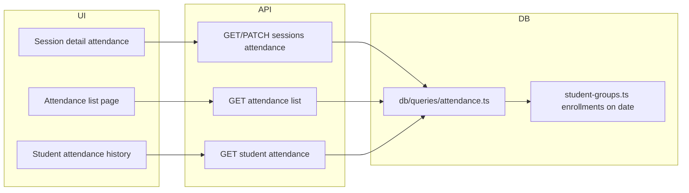

# Phase 5 — Attendance Implementation Plan

## Goal

Capture what actually happened: attendance per student per session with states (present / absent / excused / late), teacher marking UI, admin override with audit, and missing-attendance detection. **Deliverable:** Reliable operational truth (foundation for Phase 8 teacher payouts and reporting).

## Current State

- **Schema:** [db/schema.ts](c:\myCode\ritmo\ritmo\db\schema.ts) already defines `attendanceRecords` (`class_session_id`, `student_id`, `status`, `marked_at`) and `attendanceStatusEnum` (present, absent, excused, late). No query or API layer exists for attendance; tenant isolation is enforced via session (session has `organization_id`).
- **Session detail:** [app/[locale]/organizations/[id]/sessions/[sessionId]/page.tsx](c:\myCode\ritmo\ritmo\app\[locale]\organizations\[id]\sessions\[sessionId]\page.tsx) has an attendance placeholder card (lines 421–429); replace with real attendance section.
- **Session DELETE:** [app/api/organizations/[id]/sessions/[sessionId]/route.ts](c:\myCode\ritmo\ritmo\app\api\organizations\[id]\sessions\[sessionId]\route.ts) has a TODO to check linked attendance before delete (line 165); implement that check and optionally block or cascade.
- **Enrollments:** [db/queries/student-groups.ts](c:\myCode\ritmo\ritmo\db\queries\student-groups.ts) has `getEnrollmentsByGroup` and `getActiveEnrollmentsByGroup(groupId, organizationId, date?)`. The latter only filters by `endDate`; for “expected at session” we need enrollments where `startDate <= session.date` and (`endDate` is null or `endDate >= session.date`). Add `getEnrollmentsByGroupOnDate(groupId, organizationId, date)` (or extend `getActiveEnrollmentsByGroup` to filter by `startDate` when `date` is provided).

## Architecture

- **API:** `/api/organizations/[id]/sessions/[sessionId]/attendance` (GET list expected + recorded, PATCH bulk/individual), `/api/organizations/[id]/attendance` (GET list with filters), `/api/organizations/[id]/students/[studentId]/attendance` (GET history).
- **Queries:** New `db/queries/attendance.ts`; reuse/extend `db/queries/student-groups.ts` for “expected students” for a session.
- **UI:** Session detail attendance section (replace placeholder), optional `/organizations/[id]/attendance` page, student profile attendance section; nav link for Attendance in [components/app-layout.tsx](c:\myCode\ritmo\ritmo\components\app-layout.tsx) if attendance page is added.

## 1. Schema (optional extensions for Phase 5)

- **Existing:** `attendance_records` and enum are sufficient for core behavior.
- **Admin override / audit:** README asks for “reason/note field for overrides” and “audit trail”. Minimal approach: add optional `note` (text) and `marked_by_user_id` (text, FK to `user.id`) to `attendance_records` via migration. Full change-history table can be a later enhancement.

**Decision:** Start with existing schema; add `note` and `marked_by_user_id` in a small migration only if you want admin-override metadata in Phase 5.

## 2. Database Layer

### 2.1 Enrollments “on session date”

- In [db/queries/student-groups.ts](c:\myCode\ritmo\ritmo\db\queries\student-groups.ts): Add **`getEnrollmentsByGroupOnDate(groupId, organizationId, date)`** returning enrollments where `startDate <= date` and (`endDate` is null or `endDate >= date`). Use this to derive “expected students” for a session. (Alternatively, extend `getActiveEnrollmentsByGroup` to accept an optional “asOfDate” and filter both start and end; keep a single source of truth.)

### 2.2 New: `db/queries/attendance.ts`

- **`getAttendanceBySession(organizationId, sessionId)`** — Get all attendance records for a session (with student info). Validate session belongs to org (tenant isolation).
- **`getAttendanceForSessionWithExpected(organizationId, sessionId)`** — Return expected students (from enrollments on session date) plus existing attendance rows; front-end can merge (expected + status or “not marked”).
- **`upsertAttendanceRecord(organizationId, data: { classSessionId, studentId, status, note?, markedByUserId? })`** — Insert or update one record (one record per student per session; unique on `(class_session_id, student_id)`). Enforce tenant isolation via session.
- **`bulkUpsertAttendanceForSession(organizationId, sessionId, entries: { studentId, status }[], markedByUserId?)`** — Set attendance for multiple students in one transaction.
- **`getAttendanceByOrganization(organizationId, filters?)`** — List attendance with filters: sessionId, studentId, dateFrom, dateTo, status. Join session/student for display; always filter via session.organizationId.
- **`getAttendanceByStudent(studentId, organizationId, filters?)`** — Attendance history for a student (for student profile).
- **`getSessionsWithMissingAttendance(organizationId, dateFrom?, dateTo?)`** — Sessions (e.g. held) that have expected students but no attendance record for at least one expected student; for “missing attendance” dashboard/list.

**Constraints:** One attendance record per (class_session_id, student_id). All queries must enforce tenant isolation via session (or organizationId through session).

### 2.3 Session delete

- In [db/queries/class-sessions.ts](c:\myCode\ritmo\ritmo\db\queries\class-sessions.ts) (or attendance): **`countAttendanceBySession(sessionId)`** or **`hasAttendanceRecords(sessionId)`**. Use in session DELETE handler: either block delete when attendance exists, or document cascade-delete of attendance (if product choice is to allow delete and remove attendance).

## 3. API Layer

- **`GET/PATCH app/api/organizations/[id]/sessions/[sessionId]/attendance/route.ts`**
  - GET: Return expected students (from enrollments on session date) + current attendance records for that session (from `getAttendanceForSessionWithExpected` or equivalent).
  - PATCH: Body `{ entries: { studentId, status }[], note? }`. Call `bulkUpsertAttendanceForSession`; optional `markedByUserId` from auth session.
- **`GET app/api/organizations/[id]/attendance/route.ts`**
  - Query params: sessionId, studentId, dateFrom, dateTo, status. Return paginated/list attendance with session and student info (from `getAttendanceByOrganization`).
- **`GET app/api/organizations/[id]/students/[studentId]/attendance/route.ts`**
  - Optional params: dateFrom, dateTo. Return attendance history for student (from `getAttendanceByStudent`).
- **`GET app/api/organizations/[id]/attendance/missing/route.ts`** (or query param on list)
  - Return sessions with missing attendance (from `getSessionsWithMissingAttendance`) for admin/reminders.

All routes: validate tenant with `enforceTenantIsolation(organizationId, user.id)` and use query helpers only with that `organizationId`.

## 4. Session DELETE and attendance

- In session DELETE handler: Call `hasAttendanceRecords(sessionId)` (or count). Either return 409 with message “Session has attendance records; remove or migrate them first” or implement cascade delete of attendance (document and test). Recommended: **block delete** and return clear error so data is not lost by accident.

## 5. UI

### 5.1 Session detail page — Attendance section (required)

- Replace the placeholder in [app/[locale]/organizations/[id]/sessions/[sessionId]/page.tsx](c:\myCode\ritmo\ritmo\app\[locale]\organizations\[id]\sessions\[sessionId]\page.tsx).
- Load expected students (enrollments on session date) + attendance for this session (GET session attendance API).
- Show list: student name, status (present/absent/excused/late) or “Not marked”. Quick-mark buttons per row; optional “Mark all present” / “Mark all absent”.
- Save via PATCH (bulk). Only show for sessions that have a group (expected students); for cancelled sessions, optionally show read-only or hide.
- Indicate “missing attendance” when expected count > 0 and some have no record (or status not set).

### 5.2 Attendance list page (recommended)

- New page: `app/[locale]/organizations/[id]/attendance/page.tsx`.
- Filters: session (or group/date range), student, date range, status. Table: session date, group, student, status, marked at. Use GET `/api/organizations/[id]/attendance`.
- Add “Missing attendance” block or link: list sessions with missing attendance (GET missing endpoint); link to session detail to fill in.

### 5.3 Student profile integration

- In [app/[locale]/organizations/[id]/students/[studentId]/page.tsx](c:\myCode\ritmo\ritmo\app\[locale]\organizations\[id]\students\[studentId]\page.tsx): Add “Attendance history” section: table or list of attendance records (date, group/session, status). Use GET `/api/organizations/[id]/students/[studentId]/attendance`. Optional: simple stats (e.g. attendance rate over last N days).

### 5.4 Admin override and audit

- **Override:** Any PATCH that changes an existing attendance record (or adds a note) can store optional `note` and `markedByUserId` (from session). Show “Edited by …” / “Note: …” in session attendance view and in attendance list if fields are present.
- **Audit:** For Phase 5, “override history” can be “last edit” (note + markedBy). Full history table (append-only change log) can be Phase 5.1 if needed.

### 5.5 Navigation

- In [components/app-layout.tsx](c:\myCode\ritmo\ritmo\components\app-layout.tsx): Add “Attendance” nav item linking to `/organizations/[id]/attendance` (if the attendance list page is implemented).

## 6. Internationalization

- Add keys to [messages/en.json](c:\myCode\ritmo\ritmo\messages\en.json) and [messages/es.json](c:\myCode\ritmo\ritmo\messages\es.json): attendance status labels (present, absent, excused, late), “Mark all present/absent”, “Not marked”, “Missing attendance”, “Attendance history”, “Expected students”, session attendance section title, any validation/error messages, and missing-attendance list copy.

## 7. Testing

- **Unit:** `db/queries/attendance.ts` — get by session, get with expected, upsert, bulk upsert, get by org (filters), get by student, get sessions with missing attendance; tenant isolation (wrong org gets no data); `getEnrollmentsByGroupOnDate` (or extended getActiveEnrollmentsByGroup) for session date.
- **Unit:** `getEnrollmentsByGroupOnDate` edge cases: startDate/endDate boundaries.
- **Integration:** API routes — GET/PATCH session attendance (auth, tenant, validation), GET attendance list (filters), GET student attendance, GET missing; session DELETE with/without attendance (block or cascade as chosen).
- **UI:** Session detail attendance flow (mark, save, reload); optional attendance list and student profile attendance (manual or e2e).

## 8. Implementation Order

1. **Enrollments on date** — `getEnrollmentsByGroupOnDate` (or extend `getActiveEnrollmentsByGroup`) in `student-groups.ts`.
2. **Attendance queries** — `db/queries/attendance.ts` (all functions above); export from [db/queries/index.ts](c:\myCode\ritmo\ritmo\db\queries\index.ts).
3. **Session delete check** — `hasAttendanceRecords` and session DELETE handler update.
4. **API** — Session attendance GET/PATCH, then org attendance list, student attendance, missing.
5. **Translations** — Attendance keys in en.json and es.json.
6. **Session detail UI** — Replace placeholder with real attendance section (load, display, quick-mark, save).
7. **Attendance list page** — New page + nav link; missing-attendance block.
8. **Student profile** — Attendance history section.
9. **Admin override** — Optional `note`/`markedByUserId` in schema + API + display (or defer to Phase 5.1).
10. **Tests** — Unit and integration as above; fix any issues from format/lint/build.

## Files Summary

| Area | New | Modified |

|------|-----|----------|

| DB | `db/queries/attendance.ts` | `db/queries/student-groups.ts` (enrollments on date), `db/queries/index.ts`, optionally `db/schema.ts` + migration (note, markedByUserId) |

| API | `app/api/.../sessions/[sessionId]/attendance/route.ts`, `app/api/.../attendance/route.ts`, `app/api/.../attendance/missing/route.ts`, `app/api/.../students/[studentId]/attendance/route.ts` | `app/api/.../sessions/[sessionId]/route.ts` (DELETE check) |

| UI | `app/[locale]/organizations/[id]/attendance/page.tsx `| Session detail page (attendance section), student detail page (attendance section), `components/app-layout.tsx` (nav) |

| i18n | — | `messages/en.json`, `messages/es.json` |

## Out of Scope for Phase 5

- Full audit log table (every change); optional “last edit” only.
- Notifications/reminders for missing attendance (Phase 10); UI list of “missing” is in scope.
- Teacher payouts based on attendance (Phase 8); this phase only records attendance.