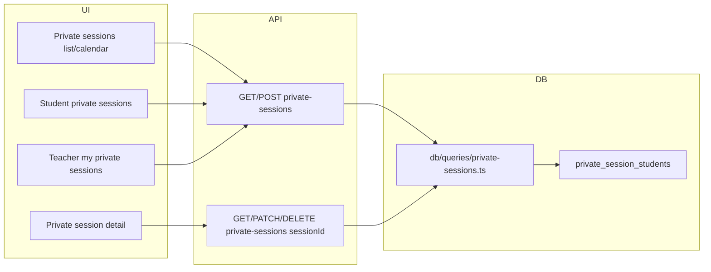

# Phase 6 — Private Classes Implementation Plan

## Goal

Support private teaching in both **1:1** (one teacher, one student) and **1-to-many** (one teacher, multiple students) formats. Private sessions are duration-based, have no group, and attendance is **implicit**: when status is "held", all assigned students are considered present (no separate attendance records). **Deliverable:** Solo teachers and school teachers can run 1:1 or small private group sessions with full UI and API.

## Current State

- **Schema:** [db/schema.ts](db/schema.ts) defines `privateSessions` with `organization_id`, `teacher_id`, **single `student_id`**, `venue_id`, `date`, `duration_minutes`, `status` (reuses `class_session_status`: scheduled/held/cancelled). The table is **1:1 only** today; 1-to-many requires a junction table.
- **Queries:** Only [lib/db-helpers.ts](lib/db-helpers.ts) has `getPrivateSessionsByOrganization(organizationId)` (simple scoped select, no joins or filters). No dedicated query module or API.
- **UI/API:** No routes under `app/api/organizations/[id]/private-sessions`, no page at `/organizations/[id]/private-sessions`, no nav link in [components/app-layout.tsx](components/app-layout.tsx).
- **Pattern to mirror:** Class sessions in [db/queries/class-sessions.ts](db/queries/class-sessions.ts), [app/api/organizations/[id]/sessions/route.ts](app/api/organizations/[id]/sessions/route.ts), and [app/[locale]/organizations/[id]/sessions/page.tsx](app/[locale]/organizations/[id]/sessions/page.tsx).

## Architecture

- **API:** `GET/POST /api/organizations/[id]/private-sessions `(list with filters; create with `studentIds[]`). `GET/PATCH/DELETE /api/organizations/[id]/private-sessions/[sessionId] `(detail, update status/fields, delete). Optional query params: `teacherId`, `studentId`, `dateFrom`, `dateTo`, `status`.
- **Queries:** New `db/queries/private-sessions.ts` with getByOrganization (filters), getById (with students), create (session + junction rows), update, delete; optional getByTeacher / getByStudent for teacher/student views.
- **Attendance:** No `attendance_records` for private sessions. "Implicit" = when status is "held", treat all assigned students as present (display-only in UI; Phase 8 payouts can count held private sessions for teachers/students).

## 1. Schema: Support 1-to-many students

- **New table:** `private_session_students` with `private_session_id` (FK to `private_sessions.id`), `student_id` (FK to `students.id`), unique on `(private_session_id, student_id)`. One row per student per session.
- **Migration:** Create `private_session_students`; backfill one row per existing `private_sessions` row using current `student_id`; drop column `student_id` from `private_sessions`.
- **Optional:** Add `start_time` (time, nullable) to `private_sessions` for calendar ordering and display (README emphasizes duration; start time can be optional for "slot" display). If omitted, order by date only and show duration only.
- **Relations:** In [db/schema.ts](db/schema.ts), add Drizzle relations: `privateSessions` -> teacher, venue, organization, and many `privateSessionStudents` -> students; `privateSessionStudents` -> privateSession, student.

## 2. Database layer: `db/queries/private-sessions.ts`

- **getPrivateSessionsByOrganization(organizationId, filters?)** — List sessions with optional filters: teacherId, studentId (sessions that include this student), dateFrom, dateTo, status. Join teacher, venue, and students (via junction). Return type includes `students: { id, fullName }[]`.
- **getPrivateSessionById(organizationId, sessionId)** — Single session with teacher, venue, and students; enforce tenant via organizationId.
- **createPrivateSession(organizationId, data)** — Data: teacherId, venueId (optional), date, durationMinutes, status, studentIds (array, min 1). Insert `private_sessions` row then insert N rows into `private_session_students`. Validate teacher, venue, and all students belong to org.
- **updatePrivateSession(organizationId, sessionId, data)** — Allow updating date, durationMinutes, venueId, status, and optionally studentIds (replace junction rows).
- **deletePrivateSession(organizationId, sessionId)** — Delete junction rows then session (or cascade if FK is set). No attendance check (implicit attendance only).
- **Optional:** `getPrivateSessionsByTeacher(organizationId, teacherId, filters?)`, `getPrivateSessionsByStudent(organizationId, studentId, filters?)` for teacher/student views.

Export from [db/queries/index.ts](db/queries/index.ts).

## 3. API layer

- **GET/POST `app/api/organizations/[id]/private-sessions/route.ts`**
  - GET: Query params teacherId, studentId, dateFrom, dateTo, status. Call getPrivateSessionsByOrganization; return JSON list.
  - POST: Body { teacherId, venueId?, date, durationMinutes, status, studentIds }. Validate and call createPrivateSession; return 201 with session.
- **GET/PATCH/DELETE `app/api/organizations/[id]/private-sessions/[sessionId]/route.ts`**
  - GET: getPrivateSessionById; 404 if not found or wrong org.
  - PATCH: Body { date?, durationMinutes?, venueId?, status?, studentIds? }. updatePrivateSession.
  - DELETE: deletePrivateSession; return 204.
- All routes: `getAuthenticatedSession` + `enforceTenantIsolation(organizationId, user.id)`.

## 4. UI

### 4.1 Private sessions list page (required)

- New page: `app/[locale]/organizations/[id]/private-sessions/page.tsx`.
- Table or list: date, teacher, students (names or count), venue, duration, status. Filters: teacher, student, date range, status (reuse patterns from [app/[locale]/organizations/[id]/sessions/page.tsx](app/[locale]/organizations/[id]/sessions/page.tsx)).
- Create button opens dialog: date picker, **student(s) multi-select** (required, at least one), teacher select (required), venue select (optional), duration (minutes), status (default scheduled). Submit POST then refetch.
- Row actions: view (link to detail), edit (navigate or inline), delete (confirm then DELETE).

### 4.2 Private session detail page (required)

- New page: `app/[locale]/organizations/[id]/private-sessions/[sessionId]/page.tsx`.
- Display: date, teacher, students list, venue, duration, status. Status change: Mark as held / Cancel (PATCH status). No attendance section (implicit: when held, show “All students present” or similar).
- Edit: same fields as create (date, students, teacher, venue, duration, status) via dialog or inline form. Delete with confirmation.

### 4.3 Navigation and calendar

- In [components/app-layout.tsx](components/app-layout.tsx): add “Private sessions” (or “Private classes”) nav item linking to `/organizations/[id]/private-sessions`.
- **Calendar integration:** README asks for “Private sessions visible alongside group sessions” and “Different visual styling for private vs group.” Options: (A) Add private sessions to the existing sessions list/calendar with a type badge and filter “Group | Private”; or (B) Keep separate list and add a combined calendar view later. Plan recommends (A) for single list with type indicator and filter, plus optional combined calendar in same page or a “Calendar” tab that shows both (can be Phase 6.1 if time-constrained).

### 4.4 Teacher view (recommended)

- “My private sessions” = filter by current user’s linked teacher. If the app has a “current teacher” context (e.g. from session or org member), apply teacherId filter by default on private-sessions page when viewing as teacher; or a dedicated “My private sessions” link that applies that filter.

### 4.5 Student profile integration

- In [app/[locale]/organizations/[id]/students/[studentId]/page.tsx](app/[locale]/organizations/[id]/students/[studentId]/page.tsx): add “Private sessions” section — list (or link) private sessions for this student (upcoming and/or history). Use GET private-sessions?studentId=studentId.

## 5. Internationalization

- Add keys to [messages/en.json](messages/en.json) and [messages/es.json](messages/es.json): “Private sessions”, “Private session”, “Create private session”, “Duration (minutes)”, “Student(s)”, “All students present” (for held), status labels already exist from class sessions; validation/error messages; nav label.

## 6. Testing

- **Unit:** `db/queries/private-sessions.ts` — getByOrganization (with filters), getById, create (1:1 and 1-to-many), update (including studentIds replace), delete; tenant isolation (wrong org gets no data / 404).
- **Integration:** API GET/POST list (auth, tenant, filters), GET/PATCH/DELETE detail (auth, tenant, validation); create with invalid teacher/student/venue returns 400/404.
- **UI:** Manual or e2e: create 1:1 and 1-to-many session, edit, mark held, delete; student profile shows private sessions.

## 7. Implementation order

1. **Schema migration** — Add `private_session_students`, backfill, drop `private_sessions.student_id`; add optional `start_time` if desired; add Drizzle relations.
2. **Queries** — Implement `db/queries/private-sessions.ts` (all functions above); export from index.
3. **API** — GET/POST list route; GET/PATCH/DELETE detail route.
4. **i18n** — Keys for private sessions in en.json and es.json.
5. **UI** — Private sessions list page with filters and create dialog; private session detail page with status change and edit/delete.
6. **Nav** — “Private sessions” in app layout.
7. **Teacher / student views** — Teacher filter or “My private sessions”; student profile section for private sessions.
8. **Calendar / combined view** — Optional: show private sessions in same list as group sessions with type badge and filter.
9. **Tests** — Unit and integration as above; run format, test, build.

## Files summary

| Area | New | Modified |

|------|-----|----------|

| DB | Migration (private_session_students, drop student_id), `db/queries/private-sessions.ts` | `db/schema.ts` (relations, optional startTime), `db/queries/index.ts` |

| API | `app/api/.../private-sessions/route.ts`, `app/api/.../private-sessions/[sessionId]/route.ts` | — |

| UI | `app/[locale]/.../private-sessions/page.tsx`, `app/[locale]/.../private-sessions/[sessionId]/page.tsx `| `components/app-layout.tsx` (nav), `app/[locale]/.../students/[studentId]/page.tsx` (private sessions section) |

| i18n | — | `messages/en.json`, `messages/es.json` |

## Out of scope for Phase 6

- Explicit attendance records for private sessions (implicit only).
- Recurring private session schedules (single sessions only).
- Phase 8 teacher payouts: counting private sessions can use “held” status from this phase; no payout logic here.
- Notifications/reminders (Phase 10).

## Design note: 1:1 vs 1-to-many

- **1:1:** One row in `private_session_students` per session.
- **1-to-many:** Multiple rows in `private_session_students` per session. Create form uses multi-select for students; detail page lists all students. Same API and queries support both.